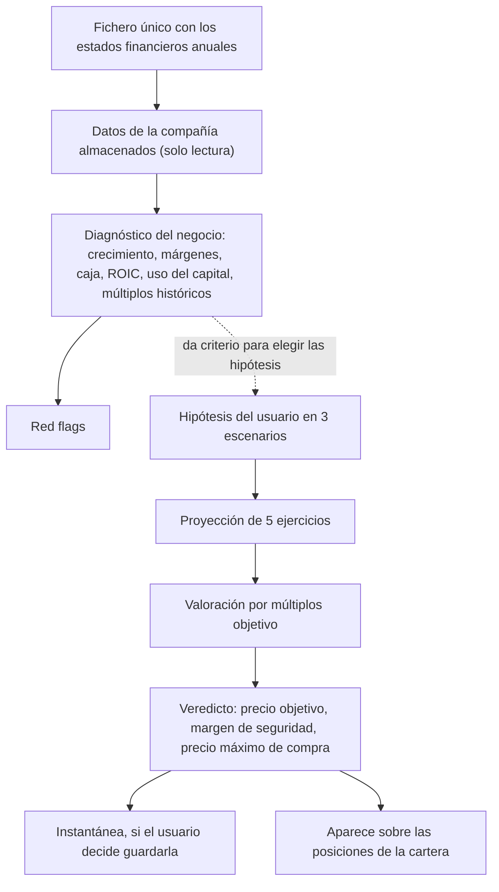
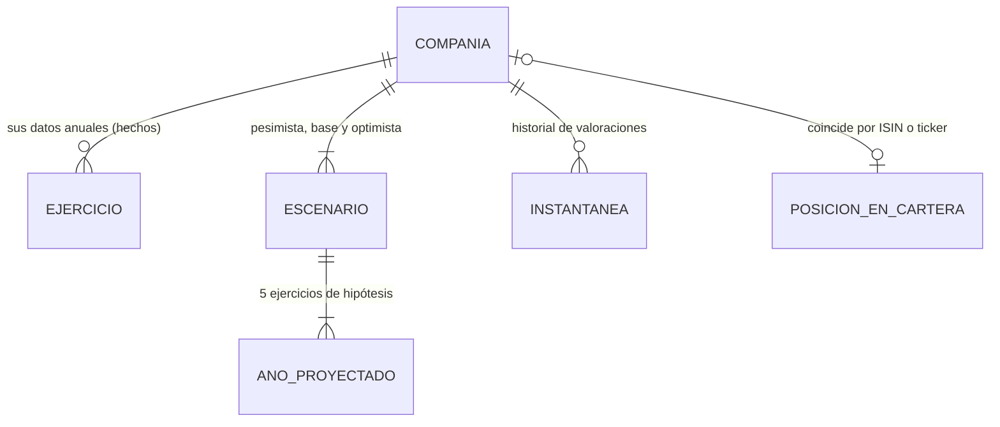
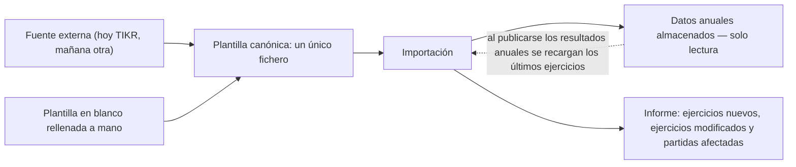
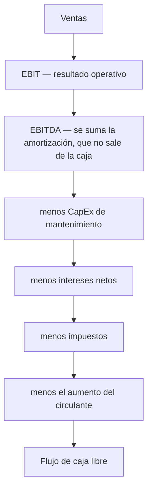
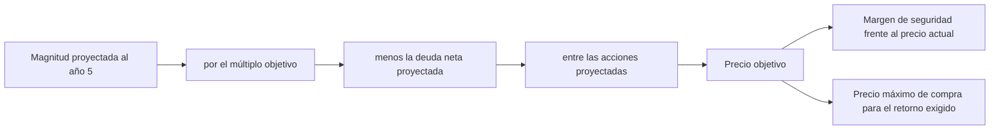

# PRD — Análisis fundamental y valoración de compañías

| Campo | Valor |
|---|---|
| Estado | 📐 **Diseño** — acordado, sin implementar |
| Versión | 0.2 |
| Última actualización | 2026-08-08 |
| Dominio | Análisis fundamental |

> Mantenimiento obligatorio: este PRD debe actualizarse en el mismo cambio de código que modifique el comportamiento del módulo. Ver `docs/README.md`.

> **Alcance de este documento**: describe **qué hace el producto y por qué**, en lenguaje de negocio. Cualquier persona debería poder leerlo sin conocer el código ni la arquitectura. Las decisiones técnicas (modelo físico, arquitectura, API, plan de implementación) viven en [[plan/analisis-fundamental]]. Este documento es el **piloto** del nuevo formato de PRD del proyecto; el resto de PRD siguen el formato anterior.

**Relacionado:** [[prd/inversiones]] · [[plan/analisis-fundamental]] · [[roadmap]]

---

## 1. Resumen

Módulo para **analizar una compañía cotizada y estimar cuánto vale**, de forma que la decisión de invertir se apoye en un número propio y no en el precio que marca el mercado.

El usuario carga los estados financieros anuales de una compañía desde un único fichero, la aplicación calcula el diagnóstico del negocio (crecimiento, rentabilidad, generación de caja, señales de alarma), el usuario expresa sus expectativas en tres escenarios, y el módulo devuelve un precio objetivo, un margen de seguridad y — lo más accionable — **el precio máximo al que puede comprar hoy para obtener el retorno anual que exige**.

## 2. Problema y contexto

Hoy el usuario hace este análisis en una hoja de cálculo. Funciona, pero tiene tres límites que un producto sí puede resolver:

- **Los datos y las opiniones están mezclados.** En una hoja, cambiar una hipótesis y corregir un dato financiero son la misma operación sobre la misma celda. No hay forma de recargar los datos sin arriesgar las hipótesis, ni de saber qué se cambió.
- **No hay memoria.** Cada revisión pisa la anterior. Es imposible responder "¿qué pensaba yo de esta compañía hace dos años y en qué me equivoqué?", que es justamente lo que permite mejorar como inversor.
- **Cada compañía es un fichero suelto.** No hay una vista que responda "de todo lo que sigo, ¿qué está barato hoy?", ni conexión con lo que realmente se tiene en cartera.

## 3. Usuarios y casos de uso

Un único usuario: el propietario de la aplicación, inversor particular que analiza compañías antes de comprarlas y revisa las que ya tiene.

Casos de uso principales:

| # | Caso de uso | Frecuencia |
|---|---|---|
| CU-1 | **Analizar una compañía nueva**: darla de alta, cargar su histórico, revisar el diagnóstico, plantear escenarios y decidir si entra en el radar y a qué precio. | Puntual, por compañía |
| CU-2 | **Actualizar tras resultados anuales**: recargar el fichero con los últimos ejercicios, ver qué ha cambiado y revisar si el veredicto se mantiene. | Anual, por compañía |
| CU-3 | **Revisar la watchlist**: mirar de un vistazo qué compañías de las que sigue están por debajo de su precio máximo de compra. | Recurrente |
| CU-4 | **Contrastar lo que tiene en cartera**: ver, sobre sus posiciones reales, si lo que posee sigue teniendo margen de seguridad. | Recurrente |
| CU-5 | **Auditar el propio criterio**: comparar una valoración guardada hace tiempo con lo que efectivamente ocurrió. | Ocasional |

## 4. Objetivos y no-objetivos

**Objetivos**

1. Mantener una lista de compañías seguidas, independiente de las que se poseen.
2. Cargar los estados financieros anuales de una compañía con **una sola operación y un solo fichero**, desde una fuente externa o rellenados a mano.
3. Diagnosticar el negocio a partir de su histórico: crecimiento, márgenes, generación de caja, retorno sobre el capital, uso del capital y señales de alarma.
4. Proyectar cinco ejercicios bajo hipótesis explícitas del usuario, en tres escenarios.
5. Traducir esas proyecciones a un precio objetivo, un margen de seguridad y un precio máximo de compra.
6. Conservar instantáneas de análisis pasados para poder auditar el criterio propio con el tiempo.
7. Enlazar el veredicto con las posiciones reales de la cartera.

**No-objetivos**

| No-objetivo | Motivo |
|---|---|
| **Compañías financieras (bancos, aseguradoras) y REITs** | El modelo se apoya en magnitudes que no significan lo mismo en esos negocios: en un banco la deuda es materia prima, no financiación, y el valor de empresa carece de sentido. Requieren otro modelo de valoración. Ver RN-16 y §15. |
| Recomendar comprar o vender | El módulo calcula bajo las hipótesis del usuario y muestra el resultado. No emite señales ni puntúa decisiones. El juicio es del usuario. |
| Datos trimestrales y estimaciones de consenso | El análisis es de tesis a largo plazo; el ejercicio anual es la unidad natural. |
| Descarga automática de datos desde SEC o API de fundamentales | Futuro (§14). La carga por fichero es suficiente para la frecuencia real de uso (una vez al año por compañía). |
| Registrar operaciones o afectar a la contabilidad | Este módulo no crea movimientos ni operaciones de cartera. Es análisis, no contabilidad. |
| Dimensionar posiciones y gestionar riesgo de cartera | Es competencia de [[prd/inversiones]]. |

## 5. Glosario

Términos de inversión usados en este documento, en lenguaje llano.

### El negocio y sus resultados

| Término | Qué es |
|---|---|
| **Análisis fundamental** | Estudiar el negocio de una compañía (lo que vende, lo que gana, lo que invierte) para estimar cuánto vale, en lugar de fijarse en el comportamiento de su cotización. |
| **Estados financieros** | Los tres documentos que publica una compañía cada año: la **cuenta de resultados** (qué ingresó y qué gastó), el **balance** (qué posee y qué debe a cierre del año) y el **estado de flujos de caja** (por dónde entró y salió el dinero). |
| **Ejercicio (fiscal)** | El año contable de la compañía. No siempre coincide con el año natural. |
| **Reexpresión** | Cuando una compañía vuelve a publicar cifras de años anteriores corregidas, normalmente porque vendió una división o cambió un criterio contable. Las cifras antiguas dejan de ser las buenas. |
| **Ventas** | Los ingresos totales del año. La línea de arriba de la cuenta de resultados. |
| **Amortización** | El reparto contable del coste de un activo a lo largo de su vida útil. Es un gasto que resta del beneficio pero **no** sale de la caja ese año. |
| **EBIT** o resultado operativo | Lo que gana el negocio con su actividad, antes de pagar intereses e impuestos. |
| **EBITDA** | El EBIT antes de restar la amortización. Se usa como aproximación bruta al dinero que genera la operación. |
| **Margen** | Un resultado dividido entre las ventas, en porcentaje. Mide cuánto se queda la compañía de cada euro que factura. |
| **Beneficio neto** | Lo que queda al final, después de todo: intereses, impuestos y extraordinarios. |
| **BPA** (beneficio por acción) | El beneficio neto dividido entre el número de acciones. Es lo que le toca a cada acción. |
| **Acciones diluidas** | El número de acciones contando también las que podrían existir si se ejercen opciones y compromisos pendientes. Es la cifra prudente. |
| **Dilución** | Que aumente el número de acciones, con lo que a cada una le toca una porción menor del negocio. Lo contrario de una recompra. |
| **Retribución en acciones** | Pagar a los empleados con acciones en vez de con dinero. No sale de la caja, pero diluye al accionista, así que es un coste real aunque no lo parezca. |

### La caja

| Término | Qué es |
|---|---|
| **Flujo de caja libre (FCF)** | El dinero que sobra de verdad tras pagar todo lo necesario para que el negocio siga funcionando. Es el dinero que los dueños podrían sacar sin dañar la compañía. La magnitud central de este módulo. |
| **CapEx** | La inversión en activos: fábricas, máquinas, servidores, software. |
| **CapEx de mantenimiento** | La parte del CapEx que solo sirve para que el negocio siga como está. Ninguna compañía la publica, así que se estima (RN-7). |
| **CapEx de expansión** | La parte del CapEx destinada a crecer. Es opcional: una compañía puede dejar de hacerlo sin morir. |
| **Circulante** | El dinero atrapado en el día a día del negocio: existencias y lo que deben los clientes, menos lo que se debe a proveedores. Si crece, consume caja. |
| **Conversión en caja** | Qué porcentaje del EBITDA acaba convirtiéndose en flujo de caja libre. Mide si el beneficio contable es dinero de verdad. |
| **Asignación de capital** | Qué hace la dirección con la caja que genera: invertir en crecer, comprar otras compañías, recomprar acciones, pagar dividendos o quitarse deuda. Revela sus prioridades mejor que cualquier declaración. |

### La rentabilidad del capital

| Término | Qué es |
|---|---|
| **Capital invertido** | El dinero total puesto en el negocio, tanto de los accionistas como de los acreedores. |
| **NOPAT** | El resultado operativo después de impuestos, ignorando la deuda. Lo que ganaría la compañía si no debiera nada. |
| **ROIC** | El NOPAT dividido entre el capital invertido. Responde: por cada euro metido en el negocio, ¿cuánto produce al año? Es el mejor indicador único de la calidad de un negocio. |
| **ROE** | El beneficio neto dividido entre los fondos propios. Como el ROIC, pero solo desde el punto de vista del accionista; la deuda puede inflarlo artificialmente. |
| **Tasa de reinversión** | Qué porcentaje del flujo de caja libre vuelve al negocio para hacerlo crecer. |

### La valoración

| Término | Qué es |
|---|---|
| **Valor intrínseco** | Lo que la compañía vale realmente según su capacidad de generar dinero, con independencia de a cuánto cotice hoy. |
| **Capitalización bursátil** | El precio de la acción por el número de acciones: lo que cuesta comprar la compañía entera en bolsa. |
| **Deuda neta** | La deuda total menos la caja y las inversiones financieras. Si es negativa, la compañía tiene más caja que deuda ("caja neta"). |
| **Valor de empresa (EV)** | La capitalización más la deuda neta: lo que costaría comprar la compañía entera y quedarse también con su deuda. |
| **Múltiplo** | Cuántas veces una magnitud está contenida en el precio. Un **PER** de 20 significa que se paga 20 veces el beneficio anual. **EV/FCF**, **EV/EBITDA** y **EV/EBIT** son lo mismo usando el valor de empresa. |
| **Múltiplo objetivo (o de salida)** | El múltiplo al que el usuario cree razonable que cotizará la compañía dentro de cinco años. Es una hipótesis, no un dato. |
| **Precio objetivo** | El precio por acción que resulta de aplicar el múltiplo objetivo a las cifras proyectadas. |
| **Margen de seguridad** | Cuánto más barata está la acción respecto a lo que se cree que vale, en porcentaje. Es el colchón para cuando el análisis se equivoque (que se equivocará). |
| **Potencial de revalorización** | Cuánto podría subir la acción desde el precio actual hasta el precio objetivo. |
| **Retorno anualizado** | El potencial repartido año a año, para poder compararlo con otras alternativas de inversión. |
| **Retorno exigido** | La rentabilidad anual mínima que el usuario pide a una inversión para que le compense. Es lo que convierte un precio objetivo en un precio máximo de compra. |
| **Escenario** | Un juego completo de hipótesis sobre el futuro de la compañía. El módulo maneja tres: pesimista, base y optimista. |
| **CAGR** | El crecimiento medio anual de una magnitud a lo largo de varios años. |
| **Mediana** | El valor central de una serie. Se usa en vez de la media porque un solo año extraordinario no la distorsiona. |
| **Red flag** | Una señal de alarma en las cuentas que invita a investigar antes de invertir. |
| **Apalancamiento** | Cuánta deuda soporta la compañía en relación a lo que genera. Se mide como deuda neta dividida entre EBITDA. |

### Otros

| Término | Qué es |
|---|---|
| **Watchlist** | La lista de compañías que el usuario sigue, tenga o no acciones de ellas. |
| **Instantánea** | Una foto congelada de un análisis completo en una fecha: los datos, las hipótesis, el precio de aquel día y el resultado. |
| **REIT** | Sociedad cotizada dedicada a poseer y alquilar inmuebles. Su contabilidad hace que las métricas de este módulo no sean interpretables. |
| **ISIN / ticker** | Los dos identificadores de un valor cotizado: el ISIN es único e internacional; el ticker es el símbolo corto de su mercado. |

## 6. Cómo funciona, de un vistazo

La separación clave es la línea entre **B** (hechos, que vienen de fuera y no se opinan) y **E** (hipótesis, que son del usuario y cambian). Todo lo demás se deriva de esas dos cosas y se recalcula solo.

## 7. Modelo conceptual

| Concepto | Qué representa | Quién lo crea |
|---|---|---|
| **Compañía** | Una empresa seguida por el usuario: nombre, identificadores, mercado, divisa en la que publica sus cuentas, escala de las cifras, tipo de negocio y sus umbrales de red flags. | El usuario, al darla de alta |
| **Ejercicio** | Los estados financieros de un año concreto de esa compañía. Es un **hecho**: viene de fuera, es de solo lectura y se sustituye recargando el fichero. | La importación |
| **Escenario** | Un juego completo de expectativas sobre los próximos cinco años, más los múltiplos objetivo y el retorno exigido. Es una **opinión**. Hay siempre tres. | El usuario |
| **Año proyectado** | Las hipótesis concretas de un año dentro de un escenario: crecimiento de ventas, margen, impuestos, variación de acciones, inversión y reparto de la caja. | El usuario |
| **Instantánea** | Una foto inmutable de todo el análisis en una fecha. No se edita nunca. | El usuario, bajo acción explícita |
| **Posición en cartera** | Correspondencia de solo lectura con lo que el usuario realmente posee, resuelta por identificador. Puede no existir. | Se deduce automáticamente |

**Regla estructural**: solo se almacenan hechos, hipótesis e instantáneas. Todo indicador (márgenes, ratios, medianas, proyecciones, múltiplos, precios objetivo, red flags) se recalcula al vuelo. Corregir un dato actualiza automáticamente todo lo que dependa de él — excepto las instantáneas ya tomadas, que por definición no cambian.

## 8. Ciclo de vida de los datos

Cuatro decisiones definen este ciclo:

**Un solo camino de entrada.** Los datos financieros entran *solo* por importación de fichero. No hay edición de cifras en pantalla: si un dato está mal, se corrige en el fichero y se vuelve a importar. Esto elimina cualquier ambigüedad sobre cuál es la versión buena de una cifra y de dónde salió.

**Un solo fichero.** La plantilla canónica contiene las cuatro secciones (resultados, balance, flujos de caja y datos de mercado) en un único documento. Cargar una compañía es una operación, no cuatro.

**La plantilla es la frontera.** El formato de la plantilla lo define la aplicación, no el proveedor. Hoy los datos se pegan desde TIKR; mañana pueden venir de otra web o de la SEC. Cambiar de fuente solo afecta a la traducción de entrada, nunca a los datos ni a los cálculos.

**Recarga completa periódica.** Cuando la compañía publica resultados, se recarga el bloque completo de los últimos ejercicios disponibles, no solo el año nuevo. Los ejercicios que ya existían se sobrescriben con lo que traiga el fichero, porque una compañía puede haber **reexpresado** años anteriores y en ese caso la cifra nueva es la buena. Para que la sobrescritura no sea silenciosa, el resumen de la importación detalla qué ejercicios cambiaron y en qué partidas: una reexpresión que mueva el flujo de caja de hace tres años mueve también la mediana de múltiplos, y esa mediana es la referencia con la que se eligen los múltiplos objetivo.

## 9. Requisitos funcionales

### Watchlist y datos

| ID | Requisito |
|---|---|
| RF-1 | El usuario puede añadir, consultar, editar y eliminar compañías de su watchlist. Al crear una compañía se declaran su nombre, identificadores, mercado, divisa de reporte, escala de las cifras y tipo de negocio. |
| RF-2 | El usuario puede descargar una **plantilla en blanco** con todas las partidas necesarias, lista para rellenar a mano cuando no disponga de una fuente externa. |
| RF-3 | El usuario puede cargar los estados financieros de una compañía subiendo **un único fichero**, ya sea la plantilla rellenada o un volcado de la fuente externa que utilice. |
| RF-4 | Al terminar una importación, el usuario ve un **informe de resultado**: ejercicios nuevos, ejercicios actualizados con detalle de qué partidas cambiaron y con qué valores, partidas no reconocidas y filas rechazadas. Una fila problemática nunca impide importar el resto. |
| RF-5 | El usuario puede consultar los ejercicios cargados de una compañía en su forma original. Los datos son de **solo lectura**; para corregirlos se vuelve a importar. |
| RF-6 | El usuario puede eliminar ejercicios sueltos de una compañía. |

### Diagnóstico del negocio

| ID | Requisito |
|---|---|
| RF-7 | El usuario ve la **evolución del negocio** por ejercicio: ventas, márgenes, beneficio, beneficio por acción y número de acciones, con su crecimiento interanual y el crecimiento medio anual del periodo. |
| RF-8 | El usuario ve el **flujo de caja libre** por ejercicio con su desglose completo, su margen, el flujo por acción, la conversión en caja y los ratios de eficiencia, junto a la mediana del periodo. |
| RF-9 | El usuario ve la **asignación del capital** por ejercicio: qué porcentaje del flujo de caja libre se destinó a crecer, a comprar otras compañías, a recomprar acciones, a repartir dividendos y a reducir deuda. |
| RF-10 | El usuario ve los **retornos sobre el capital** por ejercicio: NOPAT, capital invertido, ROIC, ROE y tasa de reinversión, con sus medianas. |
| RF-11 | El usuario ve los **múltiplos históricos** por ejercicio y su mediana, junto a la deuda neta y el apalancamiento. |
| RF-12 | El usuario ve las **red flags**: partidas sospechosas como porcentaje de ventas por ejercicio, y el recuento de ejercicios que incumplen cada umbral. Puede ajustar los umbrales para esa compañía concreta. |

### Valoración

| ID | Requisito |
|---|---|
| RF-13 | El usuario define, para cada uno de los tres escenarios, sus hipótesis año a año y sus múltiplos objetivo, y puede **copiar las hipótesis de un escenario a otro** para derivar el pesimista y el optimista del base cambiando solo lo necesario. |
| RF-14 | El usuario ve, por escenario, la **cuenta de resultados y el flujo de caja proyectados** a cinco ejercicios, con la evolución resultante de la caja y la deuda neta. |
| RF-15 | El usuario ve, por escenario, el **precio objetivo** por método y por año proyectado, su promedio, el margen de seguridad, el potencial de revalorización y el retorno anualizado. |
| RF-16 | El usuario ve el **precio máximo de compra**: el precio al que tendría que comprar hoy para obtener el retorno anual que exige. |
| RF-17 | El precio actual de la acción se obtiene automáticamente, con posibilidad de introducirlo a mano cuando la fuente no cubra ese mercado. |

### Memoria y conexión con la cartera

| ID | Requisito |
|---|---|
| RF-18 | El usuario puede **guardar una instantánea** del análisis en cualquier momento, consultarla después con las cifras de aquel día intactas y compararla con la situación actual. |
| RF-19 | La **watchlist** muestra un listado comparativo de todas las compañías seguidas con su veredicto actual, ordenable por margen de seguridad, para responder "¿qué está barato hoy?". |
| RF-20 | Cuando una compañía analizada coincide con una posición real de la cartera, la pantalla de posiciones muestra su margen de seguridad, su precio objetivo y potencial, y un **aviso cuando la valoración está caducada**. Las posiciones sin análisis ofrecen un acceso directo para crear la ficha. |

## 10. Reglas de negocio

### Principios

| ID | Regla |
|---|---|
| RN-1 | **Aislamiento.** El módulo no crea ni modifica nada fuera de él: ni movimientos domésticos, ni operaciones, ni posiciones de cartera. Hacia fuera solo lee: el precio de la acción y la correspondencia con lo que el usuario posee. |
| RN-2 | **Hechos y opiniones, separados.** Los datos financieros son hechos: entran solo por importación, son de solo lectura y se sustituyen recargando. Las hipótesis son opiniones del usuario y se editan libremente. Ningún cambio en unos afecta a los otros. |
| RN-3 | **Nada se guarda calculado.** Ratios, medianas, proyecciones, múltiplos, precios objetivo y red flags se derivan siempre de los datos y las hipótesis vigentes. La única excepción son las instantáneas, que por definición congelan resultados. |
| RN-4 | **Convenio de signos.** Las cifras se introducen tal como las publica la fuente: **salida de dinero en negativo, entrada en positivo**. Amortizaciones, gastos financieros, impuestos, inversiones, recompras y dividendos pagados van en negativo. Así la carga es copia directa, sin traducir signos. |
| RN-5 | **Sin conversión de divisa.** Los estados financieros, el precio de la acción y todos los resultados viven en la divisa en la que publica la compañía. El margen de seguridad es un porcentaje: convertirlo a euros solo añadiría error de tipo de cambio sin aportar nada. El precio debe llegar en esa misma divisa; si no, se normaliza cuando la equivalencia es conocida y, si no lo es, se pide a mano. |
| RN-6 | **Horizontes.** La proyección es **siempre de cinco ejercicios**: es lo que estructura la valoración y el retorno anualizado. El histórico es de **entre 5 y 15 ejercicios**, por defecto 5; ni tiene que ser múltiplo de cinco ni estrictamente contiguo. |

### Cómo se calcula el diagnóstico

| ID | Regla |
|---|---|
| RN-7 | **Flujo de caja libre.** Se construye partiendo del EBITDA y restando lo que el negocio necesita para seguir funcionando:  `FCF = EBITDA − CapEx de mantenimiento − intereses netos − impuestos − aumento del circulante` El **CapEx de mantenimiento** no lo publica ninguna compañía, así que se estima como la depreciación del ejercicio, **acotada por la inversión realmente ejecutada** (si se invirtió menos que la depreciación, todo lo invertido fue mantenimiento), más la inversión en intangibles. El resto del CapEx es expansión. El **circulante** es existencias más clientes, menos proveedores e ingresos diferidos. |
| RN-8 | **Calidad de la caja.** El margen de FCF es el FCF sobre ventas; la conversión en caja es el FCF sobre EBITDA. Ambos se acompañan de su mediana del periodo, porque un año suelto no dice nada. |
| RN-9 | **Asignación del capital.** Por ejercicio y como porcentaje del FCF: expansión, adquisiciones netas de desinversiones, recompras, dividendos y amortización neta de deuda. **El total puede superar el 100 %**, y eso es información valiosa: significa que ese año se gastó más de lo generado, tirando de caja o de deuda. Con FCF negativo los porcentajes no se calculan, porque dividir por un número negativo produce signos engañosos. |
| RN-10 | **Retornos sobre el capital.** `NOPAT = EBIT × (1 − tasa impositiva)`. El **capital invertido** son los fondos propios más toda la deuda y los arrendamientos operativos, menos las inversiones financieras. `ROIC = NOPAT / capital invertido`; `ROE = beneficio neto / fondos propios`. La **tasa de reinversión** es la inversión en crecimiento (expansión más adquisiciones netas) sobre el FCF. |
| RN-11 | **Múltiplos.** `deuda neta = deuda total − caja e inversiones financieras` (negativa significa caja neta); `valor de empresa = capitalización + deuda neta`. De ahí PER, EV/FCF, EV/EBITDA y EV/EBIT por ejercicio, y su mediana. Un ejercicio sin capitalización conocida queda fuera del múltiplo y de la mediana; no cuenta como cero. |
| RN-12 | **Toda métrica agregada declara su base.** Medianas, crecimientos medios y recuentos se calculan sobre los ejercicios disponibles, y siempre se muestra **sobre cuántos años**. Con menos de diez se avisa. El motivo es concreto: una mediana de múltiplos calculada sobre un periodo corto que coincida con una expansión del mercado arrastra hacia arriba el múltiplo objetivo, y con él todo el veredicto. El módulo no corrige ese sesgo; lo hace visible. |
| RN-13 | **Red flags.** El módulo trae unos umbrales por defecto (ROIC pobre por debajo del 10 %, apalancamiento por encima de 2,5 veces) que el usuario puede **sobrescribir por compañía** — una eléctrica y una tecnológica no soportan la misma deuda. Todo umbral sobrescrito se marca visualmente, para que al comparar dos compañías se vea si se están midiendo con la misma vara. Se cuentan los ejercicios con ventas decrecientes, margen operativo decreciente, FCF negativo, ROIC bajo umbral y apalancamiento sobre umbral; y se muestran, como porcentaje de ventas, deterioros, desinversiones, retribución en acciones, emisión de acciones y cargos extraordinarios. |

### Cómo se proyecta y se valora

| ID | Regla |
|---|---|
| RN-14 | **Un escenario es un juego completo de hipótesis.** No hay palancas compartidas entre escenarios: cada uno lleva sus cinco años de expectativas, sus cuatro múltiplos objetivo y su retorno exigido. Se parte del **base** y se derivan los otros dos copiándolo y cambiando lo necesario. El **base** gobierna el veredicto de cabecera, la watchlist y lo que se muestra sobre la cartera; el **pesimista** responde a la pregunta que de verdad importa: cuánto se puede perder si el análisis falla. |
| RN-15 | **La proyección encadena.** De las ventas y el margen sale el resultado operativo; de ahí el EBITDA, el resultado antes de impuestos, el beneficio y — con la variación de acciones — el beneficio por acción. En paralelo, el porcentaje de inversión y de circulante producen el flujo de caja libre proyectado, y el reparto de ese flujo (expansión, adquisiciones, recompras, dividendos, deuda) determina cuánta caja sobra o falta cada año, lo que modifica la deuda neta. **Esto cierra el circuito con la valoración**: la deuda neta proyectada entra directamente en el precio objetivo, así que las decisiones de reparto de caja afectan al valor por dos vías simultáneas (menos acciones y distinta deuda). |
| RN-16 | **Precio objetivo.** Para cada método, año y escenario: `precio objetivo = (magnitud proyectada × múltiplo objetivo − deuda neta proyectada) ÷ acciones proyectadas` usando el beneficio neto para el PER y el FCF, EBITDA o EBIT para los tres múltiplos de valor de empresa. La deuda neta se resta **siempre y de forma simétrica**: con caja neta suma valor, con deuda neta lo resta. El precio objetivo del escenario es el **promedio de los métodos con múltiplo objetivo informado**; los demás no promedian. |
| RN-17 | **Veredicto.** `margen de seguridad = (precio objetivo − precio actual) ÷ precio objetivo` `potencial = (precio objetivo − precio actual) ÷ precio actual` `retorno anualizado = (precio objetivo del año 5 ÷ precio actual) elevado a 1/5, menos 1` **`precio máximo de compra = precio objetivo del año 5 ÷ (1 + retorno exigido) elevado a 5`** |
| RN-18 | **Las instantáneas son inmutables y congelan tres cosas a la vez**: las hipótesis, **los datos financieros usados** y el precio de la acción de aquel día. Congelar solo las hipótesis haría que una recarga posterior de datos reexpresados cambiase retroactivamente el resultado de una instantánea antigua, destruyendo justo lo que se quiere medir. Una instantánea no se edita: se borra o se toma otra. |
| RN-19 | **Compañías financieras y REITs.** Se pueden dar de alta y registrar su histórico, pero la ficha muestra un aviso permanente de que las métricas basadas en valor de empresa, deuda neta, capital invertido y flujo de caja libre **no son interpretables** para ese tipo de negocio. El módulo no lo impide — el usuario puede querer guardar los datos — pero tampoco finge que el veredicto sirve. |
| RN-20 | **Correspondencia con la cartera.** Una compañía se corresponde con una posición cuando coinciden por ISIN, o por ticker si falta el ISIN en alguno de los dos lados. No existir correspondencia es normal y no es un error. |
| RN-21 | **Borrado.** Una compañía con instantáneas no se puede eliminar: primero se borran sus instantáneas. Borrar un ejercicio sí es libre, porque es un dato recargable. |

### El flujo de caja libre, visualmente

### Del flujo de caja al precio máximo de compra

## 11. Experiencia de usuario

El módulo aparece como una entrada propia, **Análisis**, dentro del área de Inversión, y se compone de dos pantallas.

### Watchlist

Tabla comparativa de todas las compañías seguidas: nombre y ticker, precio actual, precio objetivo del escenario base, margen de seguridad con color según el signo, número de red flags activas y antigüedad del análisis. Ordenable por margen de seguridad, porque la pregunta que responde esta pantalla es "¿por dónde miro hoy?".

### Ficha de compañía

**El veredicto va arriba y siempre visible.** Es lo que una hoja de cálculo no puede hacer: destacar la conclusión por encima del detalle. La cabecera muestra el precio actual con su fecha y procedencia, el precio objetivo del escenario base y su potencial, **los tres márgenes de seguridad en una sola línea** (el pesimista destacado, porque mide el riesgo), el precio máximo de compra contrastado con el precio actual, un semáforo de red flags, y la antigüedad de los datos y de las hipótesis con aviso si están caducados. Desde ahí se cambia de escenario, y ese cambio gobierna todas las pantallas de proyección. Si la compañía es financiera o REIT, un aviso permanente acompaña la cabecera.

Debajo, el detalle organizado en secciones:

| Sección | Contenido |
|---|---|
| **Resultados** | Histórico y proyección de la cuenta de resultados, años en columnas. Las celdas de hipótesis (crecimiento, margen, impuestos, variación de acciones) se editan directamente sobre la tabla. Al lado, los crecimientos medios y promedios del histórico, que son el criterio con el que se eligen esas hipótesis. |
| **Flujo de caja** | Desglose del flujo de caja libre, márgenes, ratios de eficiencia con su mediana, y la asignación del capital histórica y proyectada, también editable. |
| **Retornos** | NOPAT, capital invertido, ROIC, ROE y tasa de reinversión, con medianas. |
| **Valoración** | Múltiplos históricos y sus medianas; múltiplos objetivo editables; precio objetivo por método y año, con promedio, margen de seguridad y potencial; retorno anualizado; y el precio máximo de compra con el retorno exigido editable. |
| **Red flags** | Partidas sospechosas sobre ventas y recuento de incumplimientos, con los umbrales editables y marcados cuando están sobrescritos. |
| **Gráficos** | Evolución de ventas, beneficio por acción y flujo por acción; márgenes; flujo de caja frente a ROIC; estructura de costes sobre ventas; evolución de múltiplos. |
| **Datos** | Ejercicios cargados en su forma original (solo lectura), carga de fichero con su informe de resultado, y descarga de la plantilla en blanco. |
| **Instantáneas** | Historial con fecha, etiqueta, precio de aquel día, precio objetivo y margen de seguridad de entonces, y comparación con la situación actual. |

Toda métrica agregada indica sobre cuántos años se ha calculado (RN-12). La presentación sigue el sistema de diseño de la aplicación, incluidos el tema claro/oscuro y el uso de tipografía monoespaciada para todas las cifras.

### Sobre la cartera

La tabla de posiciones gana, para las posiciones con análisis, el margen de seguridad, el precio objetivo con su potencial y el indicador de valoración caducada. Las posiciones sin análisis muestran un guion y un acceso para crear la ficha con los identificadores ya rellenos. Para quien no use el módulo, la pantalla no cambia.

## 12. Validaciones y mensajes

| Situación | Qué ocurre |
|---|---|
| Alta de compañía con un identificador ya existente | Se rechaza indicando cuál es la compañía que ya lo usa. |
| Ejercicio sin ventas | Se rechaza: sin ventas no hay márgenes ni ratios que calcular. |
| Cifra con el signo contrario a su naturaleza (ventas negativas, inversión positiva, amortización positiva) | Se rechaza la fila indicando la partida y el signo esperado. |
| Partida del fichero no reconocida | Se ignora y se lista en el informe; el resto se importa. |
| Valor no numérico o separador decimal incoherente | La fila se rechaza y el resto se importa. El separador decimal se comprueba de forma explícita: es el fallo más frecuente al pegar datos de una fuente extranjera. |
| Ejercicio ya cargado | Se sobrescribe y se detalla en el informe qué partidas cambiaron y con qué valores (§8). |
| Compañía con menos de dos ejercicios | El análisis se calcula igual, pero se avisa: sin año anterior no hay variación de circulante ni crecimientos, y las medianas carecen de sentido. |
| Múltiplo objetivo sin informar | Ese método no produce precio objetivo y no entra en el promedio. No es un error. |
| Precio actual desconocido | Margen de seguridad, potencial y retorno anualizado se muestran vacíos. El precio objetivo sí se calcula: no depende del mercado. |
| Precio recibido en una divisa distinta de la de reporte | Se normaliza si la equivalencia es conocida; si no, se descarta con aviso y se pide a mano. |
| Intento de eliminar una compañía con instantáneas | Se rechaza indicando cuántas instantáneas hay que borrar antes. |

## 13. Casos límite y limitaciones conocidas

- **La mediana de múltiplos sobre pocos años es el punto débil del método.** Es la referencia con la que se elige el múltiplo objetivo, y el múltiplo objetivo determina el precio objetivo. Una mediana calculada sobre cinco años que caen dentro de una expansión de mercado arrastra el veredicto entero hacia arriba. Por eso RN-12 obliga a declarar la base de años y a avisar por debajo de diez.
- **El CapEx de mantenimiento es una estimación, no un dato.** Ninguna compañía publica cuánto de su inversión sostiene el negocio y cuánto lo hace crecer. La aproximación de RN-7 es conservadora y razonable, pero en negocios con activos muy antiguos o muy intensivos en investigación puede quedarse corta o larga — y como el flujo de caja libre depende de ella, el error se propaga al precio objetivo por dos vías.
- **Los intereses proyectados son una estimación.** En el futuro no hay estados financieros de los que leerlos, así que se aplican los tipos medios implícitos del histórico a la deuda y la caja que resultan del reparto proyectado. Es una aproximación de un solo paso, no un cálculo circular.
- **Los cambios de perímetro rompen la comparabilidad** sin que el módulo pueda detectarlo. Una gran adquisición o una escisión hacen que la serie histórica mezcle negocios distintos, y los crecimientos medios y las medianas se seguirán calculando sobre datos no homogéneos. Se asume que el usuario conoce la compañía que analiza.
- **Los ejercicios fiscales no siempre coinciden con el año natural.** Se registran tal como los etiqueta la compañía, sin desplazarlos. Comparar compañías con cierres distintos es responsabilidad del usuario.
- **Compañías recién salidas a bolsa**: funcionan con los ejercicios que haya, con las medianas y los crecimientos calculados sobre menos años y avisados como tales.
- **El precio objetivo no es una predicción.** Es la consecuencia aritmética de las hipótesis introducidas; dos escenarios igualmente defendibles pueden diferir en un 50 %. Por eso el veredicto muestra los tres márgenes de seguridad a la vez y nunca un número único.

## 14. Evolución prevista

Ideas fuera del alcance inicial, ordenadas por valor esperado:

- **Descuento de flujos (DCF) y DCF inverso.** El primero descuenta al presente el flujo de caja ya proyectado; el segundo resuelve al revés qué crecimiento está descontando el precio actual — probablemente lo más útil de todo: "el mercado espera un 14 % anual durante diez años, ¿me lo creo?". Reutiliza la proyección existente y se añade como dos métodos más de precio objetivo.
- **Tabla de sensibilidad**: cómo cambia el precio objetivo variando dos palancas a la vez, para ver dónde está el riesgo real de la valoración.
- **Valoración por poder de beneficio y fórmulas clásicas** como contraste rápido y conservador del método por múltiplos.
- **Modelo alternativo para compañías financieras y REITs**, con sus propias métricas. Es otro modelo y merecerá su propio PRD.
- **Carga automática de datos** desde SEC/EDGAR o una fuente con API, sustituyendo la importación manual sin tocar nada más: la plantilla ya actúa de frontera.
- **Comparativa entre compañías** de la watchlist sobre las mismas métricas.
- **Alertas de precio** cuando una compañía seguida cruza su precio máximo de compra.
- **Tesis escrita** asociada a la compañía y congelada en cada instantánea.
- **Datos trimestrales**, para acortar el tiempo entre resultados y revisión.

## 15. Decisiones tomadas y deuda conocida

| Tema | Decisión | Consecuencia asumida |
|---|---|---|
| **Financieras y REITs** | Fuera de alcance en la primera versión (RN-19). | Deuda conocida y aceptada. Empezar por las no financieras cubre la mayor parte del universo cotizado; cubrir el resto exige otro modelo de valoración y otra versión del módulo. |
| **Datos de solo lectura** | Los datos financieros entran solo por importación y no se editan en pantalla (RN-2). | Corregir un dato obliga a rehacer el fichero y recargar. A cambio, nunca hay duda sobre cuál es la versión buena de una cifra. |
| **Sobrescritura en la recarga** | Al reimportar, lo que traiga el fichero gana (§8). | Es lo contablemente correcto ante reexpresiones. El informe de cambios evita que la sobrescritura pase inadvertida. |
| **Deuda neta simétrica** | El método basado en PER resta la deuda neta igual que los otros tres (RN-16). | Se aparta deliberadamente de la hoja de cálculo de origen, que sumaba la caja neta pero no restaba la deuda. En compañías endeudadas los resultados diferirán, y el motivo es este. |
| **Umbrales por compañía** | Valores por defecto del módulo con override individual (RN-13). | Dos compañías pueden estar medidas con varas distintas; por eso todo umbral sobrescrito se marca visualmente. |
| **Mediana con pocos años** | Se calcula sobre lo disponible y se avisa (RN-12). | Pendiente de revisar con uso real si conviene exigir un mínimo de años para mostrar veredicto en la watchlist. |
| **CapEx de mantenimiento** | Estimación por depreciación acotada (RN-7). | Si el flujo resultante se separa sistemáticamente del obtenido por otras vías, habrá que permitir un ajuste manual por ejercicio. |
| **Intereses proyectados** | Tipos medios implícitos del histórico (§13). | Pendiente de revisar en compañías con estructura de capital cambiante. |

---

**Diseño técnico** (modelo físico, arquitectura, API y plan de implementación): [[plan/analisis-fundamental]].
